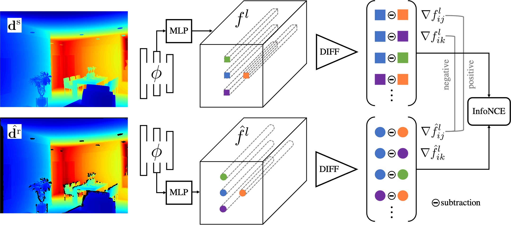

# DCL-DepthSynthesis (DCL)
Unpaired Depth Synthesis Using Differential Contrastive Learning 

We provide our PyTorch implementation of the paper **'Differential Contrastive Learning for Geometry-Aware Depth Synthesis.'** By proposed differential contrastive learning, our method can generate geometry-preserved depth maps comparing to previous methods.



## Prerequisites

- Linux (Ubuntu is suggested)
- Python 3
- NVIDIA GPU, CUDA and CuDNN

## Requirements

- pytorch >= 1.4 (for loading our pre-trained checkpoints, pytorch >= 1.8 is required.)
- tensorboardX
- numpy, h5py, opencv-python

## Usage

### Evaluation on depth synthesis

We provide our pre-trained checkpoints for depth synthesis and sampled some data for evaluation. The outputs can be found in ./DepthSynthesis/datasets/eval_outputs/

```shell
cd DepthSynthesis
python evaluation_demo.py
```

### Evaluation on depth synthesis

We provide our pre-trained checkpoints for *Monet-to-photo* translation and sampled some data for evaluation. The outputs can be found in ./DepthSynthesis/datasets/eval_outputs/

```shell
cd DepthSynthesis
python evaluation_demo.py --name monet2photo --dataset monet2photo --input_nc 3 --output_nc 3 --ngf 64 --ndf 64 --netG resnet_9blocks --normG instance --normD instance --zoom_out_scale 0 --eval_dir ./datasets/eval_monet/
```

### Training on depth synthesis

1. Download [InteriorNet](https://interiornet.org/) and [ScanNet](http://www.scan-net.org/) datasets.

2. Extract depth and rgb frames from two datasets.

3. Start training

   ```shell
   cd DepthSynthesis
   python train.py --dataset depthsynthesis --data_path_clean $your_path_to_interiornet --data_path_noise $your_path_to_scannet
   ```

### Training on RGB image translation

1. Download datasets follow [this](https://github.com/taesungp/contrastive-unpaired-translation/blob/master/datasets/download_cut_dataset.sh).

2. Start training

   ```shell
   cd DepthSynthesis
   python train.py --dataset $RGB_dataset(for example: horse2zebra) --data_path_image your_path_to_RGB_datasets --input_nc 3 --output_nc 3
   ```

## Sampled Results

### Depth synthesis

CycleGAN, CUT and Coupled are previous works.


### RGB image translation


## Acknowledgments

Our code is developed based on [contrastive-unpaired-translation](https://github.com/taesungp/contrastive-unpaired-translation). We also thank [Synchronized-BatchNorm-PyTorch](https://github.com/junyanz/pytorch-CycleGAN-and-pix2pix) for synchronized batchnorm implementation.