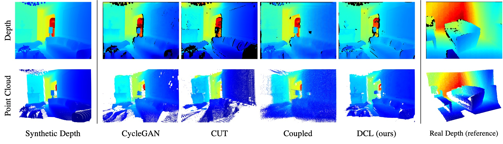
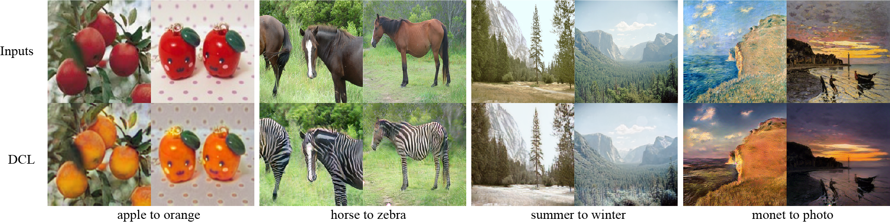

# DCL-DepthSynthesis (DCL)
Unpaired Depth Synthesis Using Differential Contrastive Learning 

We provide our PyTorch implementation of our paper **['DCL: Differential Contrastive Learning for Geometry-Aware Depth Synthesis'](https://arxiv.org/pdf/2107.13087.pdf)** (RA-L & ICRA 2022). By proposed differential contrastive learning, our method can generate geometry-preserved depth maps comparing to previous methods.


## Prerequisites

- Linux (Ubuntu is suggested)
- Python 3
- NVIDIA GPU, CUDA and CuDNN

## Requirements

- pytorch >= 1.4 (for loading our pre-trained checkpoints, pytorch >= 1.8 is required.)
- tensorboardX
- numpy, h5py, opencv-python

## Usage

### Evaluation on depth synthesis

We provide our pre-trained checkpoints for depth synthesis and sampled some data for evaluation. The outputs can be found in ./DepthSynthesis/datasets/eval_outputs/

```shell
cd DepthSynthesis
python evaluation_demo.py
```

### Evaluation on RGB synthesis

We provide our pre-trained checkpoints for *Monet-to-photo* translation and sampled some data for evaluation. The outputs can be found in ./DepthSynthesis/datasets/eval_outputs/

```shell
cd DepthSynthesis
python evaluation_demo.py --name monet2photo --dataset monet2photo --input_nc 3 --output_nc 3 --ngf 64 --ndf 64 --netG resnet_9blocks --normG instance --normD instance --zoom_out_scale 0 --eval_dir ./datasets/eval_monet/
```

### Training on depth synthesis

1. For depth enhancement, normal prediction and semantic segmentation tasks, download [InteriorNet](https://interiornet.org/) and [ScanNet](http://www.scan-net.org/) datasets. For poes estimation and grasping prediction tasks, download [preprocessed LineMOD](https://drive.google.com/drive/folders/19ivHpaKm9dOrr12fzC8IDFczWRPFxho7) and [GraspNet](https://graspnet.net/) datasets.

2. Extract depth and rgb frames from [InteriorNet](https://interiornet.org/) or [ScanNet](http://www.scan-net.org/) datasets.

3. Start training [InteriorNet](https://interiornet.org/) to [ScanNet](http://www.scan-net.org/).

   ```shell
   cd DepthSynthesis
   python train.py --dataset IN2SNdepthsynthesis --data_path_clean $your_path_to_interiornet --data_path_noise $your_path_to_scannet
   ```

4. Render synthetic depth maps from [preprocessed LineMOD](https://drive.google.com/drive/folders/19ivHpaKm9dOrr12fzC8IDFczWRPFxho7) and [GraspNet](https://graspnet.net/) datasets. Please refer to my repo [ObjsDepthRender](https://github.com/Jhonve/ObjsDepthRender).

5. Start training depth synthesis for [preprocessed LineMOD](https://drive.google.com/drive/folders/19ivHpaKm9dOrr12fzC8IDFczWRPFxho7) dataset or [GraspNet](https://graspnet.net/) dataset.
   ```shell
   cd DepthSynthesis

   # train on preprocessed LineMOD
   python train.py --dataset LMdepthsynthesis --data_path_clean $your_path_to_synthetic_linemod --data_path_noise $your_path_to_linemod --is_crop True

   # train on GraspNet (Realsense camera)
   python train.py --dataset S2Rdepthsynthesis --data_path_clean $your_path_to_synthetic_graspnet --data_path_noise $your_path_to_graspnet
   ```

### Training on RGB image translation

1. Download datasets follow [this](https://github.com/taesungp/contrastive-unpaired-translation/blob/master/datasets/download_cut_dataset.sh).

2. Start training

   ```shell
   cd DepthSynthesis
   python train.py --dataset $RGB_dataset(for example: horse2zebra) --data_path_image your_path_to_RGB_datasets --input_nc 3 --output_nc 3
   ```

## Sampled Results

### Depth synthesis

CycleGAN, CUT and Coupled are previous works.



### RGB image translation



### Citation

If you find this useful for your research, please cite the following paper.

```
@inproceedings{shen2022dcl,
  title={DCL: Differential Contrastive Learning for Geometry-Aware Depth Synthesis},
  author={Shen, yuefan and Yang, Yanchao and Zheng, Youyi and Liu, C. Karen and Guibas, Leonidas J.},
  journal={Proc. IEEE Int. Conf. Robot. Automat.},
  pages={},
  year={2022}
}
```

Waiting for updating...

## Acknowledgments

Our code is developed based on [contrastive-unpaired-translation](https://github.com/taesungp/contrastive-unpaired-translation). We also thank [Synchronized-BatchNorm-PyTorch](https://github.com/junyanz/pytorch-CycleGAN-and-pix2pix) for synchronized batchnorm implementation.